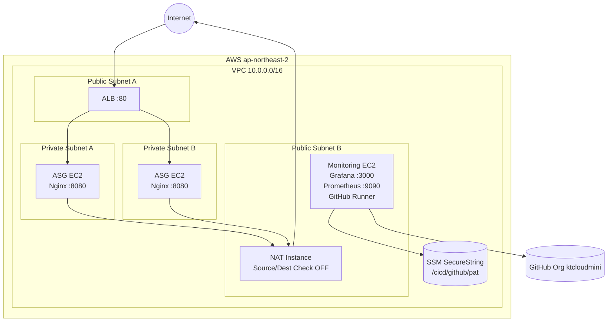

# KT Cloud Infra Project (Terraform 기반 운영 인프라)

##  Project Overview

Terraform 기반 IaC(Infrastructure as Code)로  
운영 가능한 AWS 인프라 아키텍처를 설계 및 구축.

###  설계 목표

- Public 노출은 ALB만 허용
- Service 서버는 Private Subnet 고정
- Outbound는 NAT Instance 경유만 허용
- Monitoring EC2를 통한 Bastion / CD / Ansible 실행
- destroy → apply 재현성 보장
- Prometheus 연동을 위한 자동 모니터링 기반 구축

---

#  전체 아키텍처

```mermaid
flowchart TB
  Internet((Internet))

  subgraph Public Subnet
    ALB[ALB]
    NAT[NAT Instance]
    MON[Monitoring EC2\n(Bastion + Runner + Ansible)]
  end

  subgraph Private Subnet
    ASG[ASG Service Instances\n(Node Exporter :9100)]
  end

  Internet --> ALB
  ALB --> ASG

  ASG -->|Outbound Only| NAT
  NAT --> Internet

  MON -->|SSH 22| ASG
  MON -->|Node Exporter 9100| ASG

  %% Prometheus (관제팀 설치 예정)
  MON -. EC2 Service Discovery .-> ASG
```

---

#  인프라 구성 요소

## 1 Network

- VPC
- Public / Private Subnet 분리
- IGW 연결
- Private Route → NAT Instance
# KTCloud INFRA PROJECT (Terraform)

---

## 0. Goal

Terraform 기반으로 AWS 인프라를 IaC로 구축하고 아래 목표를 충족한다.

* 구조: ALB (Public) → ASG(Service EC2, Private Subnet)
* Monitoring EC2 (Public) 제공
* Private Subnet 인스턴스는 NAT 통해서만 외부 통신
* destroy → apply 재현성 확보

Day5 성공 기준:

* NAT 전용 EC2 분리
* Private EC2 인터넷 통신 성공
* nginx 자동 설치 성공
* Target Group Healthy
* ALB DNS 200 응답
* ASG Scale-out 정상

---

# 1. Architecture

## High-level

Internet
↓
ALB (Public Subnets)
↓
Target Group
↓
ASG Service EC2 (Private Subnets) → NAT → Internet

검증 완료:
- Public → Internet OK
- Private → NAT 경유 Outbound OK

---

## 2 NAT Instance

- Source/Dest Check 비활성화
- IP Forwarding 활성화
- iptables MASQUERADE 설정
- Private Route Table 연결

검증:
- Private EC2 → GitHub API OK
- Private EC2 → apt install OK

---

## 3 Monitoring EC2

역할:

- Bastion (SSH 진입)
- GitHub Actions Runner
- Ansible 실행 노드
- Prometheus 설치 대상 (관제팀 작업)

IAM Instance Profile 적용:

- ec2:DescribeInstances
- ec2:DescribeTags
- ssm:GetParameter

검증:

```bash
aws ec2 describe-instances --max-results 5 >/dev/null && echo OK
aws ec2 describe-tags --max-results 5 >/dev/null && echo OK
```

---

## 4 ASG (Service)

- Private Subnet 배치
- Launch Template 사용
- ALB Target Group 연결
- Desired / Min / Max 설정

---

## 5 Node Exporter 자동화

ASG user_data에 포함:

- node_exporter 설치
- systemd 등록
- 자동 실행

검증:

```bash
curl localhost:9100/metrics | head
systemctl is-active node_exporter
```

---

#  Security Group 설계 (SG → SG)

## ALB SG
- 80 from 0.0.0.0/0

## Service SG (ASG)
- 8080 from ALB SG
- 9100 from Monitoring SG
- 8080 from Monitoring SG (옵션)
- 22 from Monitoring SG

## Monitoring SG
- 22 / 3000 / 9090 from allowed CIDR
- outbound all

---

#  Tag 규칙 (Prometheus Discovery 기준)

- Role = monitoring | asg | nat
- PrometheusScrape = true (ASG)

IMDS 확인:

```bash
curl http://169.254.169.254/latest/meta-data/tags/instance/Role
```

---

#  Prometheus 연동 준비 상태

- Monitoring → ASG :9100 접근 성공
- IAM EC2 SD 권한 적용 완료
- Tag 기반 Discovery 가능
- 신규 ASG 인스턴스 자동 node_exporter 실행

관제팀은 Prometheus 설치 후  
EC2 Service Discovery 설정만 추가하면 자동 수집 가능.

---

#  재현성 보장

Terraform 기준:

```bash
terraform destroy
terraform apply
```

동일 아키텍처 재생성 가능.

---

# 현재 프로젝트 상태

| 영역 | 상태 |
|------|------|
| IaC 구조 | 완료 |
| Network | 완료 |
| NAT | 완료 |
| Monitoring EC2 | 완료 |
| Runner | 완료 |
| IAM | 완료 |
| ALB | 완료 |
| ASG | 완료 |
| Node Exporter | 완료 |
| Prometheus 연동 준비 | 완료 |
| 서비스 배포 | 타팀 대기 |

---

#  담당 역할 (Infra Team)

- Terraform 기반 아키텍처 설계
- 네트워크 보안 구조 구현
- NAT 설계 및 검증
- CD 실행 기반 구축
- 모니터링 연동 기반 자동화
- Source of Truth를 코드로 유지

---
## 2. Important Outputs (Terraform)
아래 값들은 `terraform output`으로 즉시 확인 가능
Monitoring EC2 (Public): 운영/관제

---

## Detailed Architecture (IaC + Monitoring + Runner)



---

# 2. Important Outputs

항상 Terraform output으로 확인

```bash
cd terraform/env/dev
terraform output
```

출력 항목:

* alb_dns_name
* asg_name
* monitoring_public_ip
* vpc_id
* public_subnet_ids
* private_subnet_ids
* target_group_arn

---

# 3. Repository Structure

```
terraform/
├─ modules/
│  ├─ network/
│  ├─ alb/
│  ├─ asg/
│  └─ monitoring/
└─ env/dev/
```

---

# 4. Backend

* S3 Remote State
* DynamoDB Lock

예시:

```
s3://ktcloud-tfstate-xxxx/env/dev/terraform.tfstate
```

---

# 5. How to Run

## Init / Plan / Apply

```bash
cd terraform/env/dev
terraform init
terraform plan
terraform apply
```

## Destroy

```bash
terraform destroy
```

---

# 6. Verification

## ALB 확인

```bash
curl -I http://<alb_dns_name>
```

Expected:

```
HTTP/1.1 200 OK
```

---

## Target Group

AWS Console → Healthy 확인

---

## nginx 확인

```bash
systemctl status nginx
curl localhost:8080
```

---

## Private → Internet (NAT)

```bash
sudo apt update
curl ifconfig.me
```

---

# 7. Troubleshooting (NAT)

문제: NAT + Monitoring 겸용 시 SSH 불가

조치:

* NAT 전용 EC2 분리
* Source/Dest Check OFF
* ip_forward=1
* MASQUERADE 설정

---

# 8. GitHub Actions Self-Hosted Runner

Monitoring EC2에 Org Runner 구성 완료

## 구성

* Org: ktcloudmini
* Label: self-hosted
* Service: systemd
* PAT: SSM SecureString 저장

```
/cicd/github/pat
```

---

## 상태 확인

```bash
sudo systemctl status actions.runner*
```

Expected:

* active (running)
* Listening for Jobs

---

## PAT 변경 시

```bash
terraform taint module.monitoring.aws_instance.monitoring
terraform apply
```

---

# 9. Docs

장문 기록은 docs/로 분리

예:


