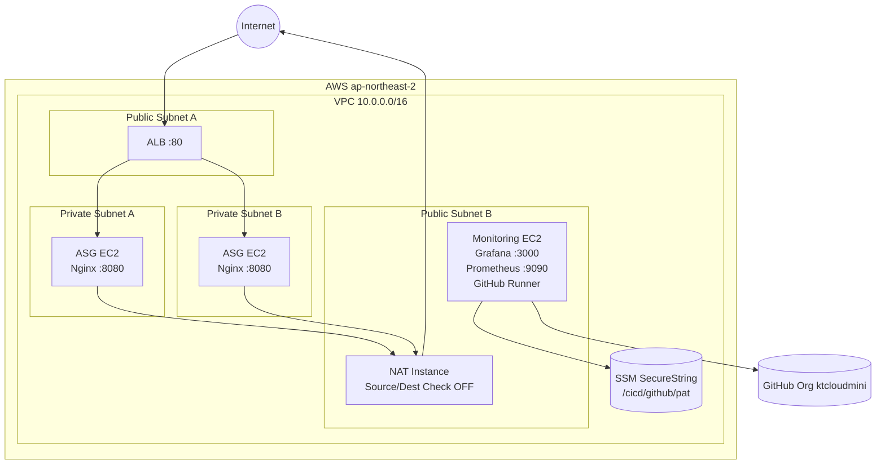

<<<<<<< HEAD
# KTCloud INFRA PROJECT (Terraform)

---

## 0. Goal

Terraform 기반으로 AWS 인프라를 IaC로 구축하고 아래 목표를 충족한다.

* 구조: ALB (Public) → ASG(Service EC2, Private Subnet)
* Monitoring EC2 (Public) 제공
* Private Subnet 인스턴스는 NAT 통해서만 외부 통신
* destroy → apply 재현성 확보

Day5 성공 기준:

* NAT 전용 EC2 분리
* Private EC2 인터넷 통신 성공
* nginx 자동 설치 성공
* Target Group Healthy
* ALB DNS 200 응답
* ASG Scale-out 정상

---

# 1. Architecture

## High-level

Internet
↓
ALB (Public Subnets)
↓
Target Group
↓
ASG Service EC2 (Private Subnets) → NAT → Internet

Monitoring EC2 (Public): 운영/관제

---

## Detailed Architecture (IaC + Monitoring + Runner)



---

# 2. Important Outputs

항상 Terraform output으로 확인

```bash
cd terraform/env/dev
terraform output
```

출력 항목:

* alb_dns_name
* asg_name
* monitoring_public_ip
* vpc_id
* public_subnet_ids
* private_subnet_ids
* target_group_arn

---

# 3. Repository Structure

```
terraform/
├─ modules/
│  ├─ network/
│  ├─ alb/
│  ├─ asg/
│  └─ monitoring/
└─ env/dev/
```

---

# 4. Backend

* S3 Remote State
* DynamoDB Lock

예시:

```
s3://ktcloud-tfstate-xxxx/env/dev/terraform.tfstate
```

---

# 5. How to Run

## Init / Plan / Apply

```bash
cd terraform/env/dev
terraform init
terraform plan
terraform apply
```

## Destroy

```bash
terraform destroy
```

---

# 6. Verification

## ALB 확인

```bash
curl -I http://<alb_dns_name>
```

Expected:

```
HTTP/1.1 200 OK
```

---

## Target Group

AWS Console → Healthy 확인

---

## nginx 확인

```bash
systemctl status nginx
curl localhost:8080
```

---

## Private → Internet (NAT)

```bash
sudo apt update
curl ifconfig.me
```

---

# 7. Troubleshooting (NAT)

문제: NAT + Monitoring 겸용 시 SSH 불가

조치:

* NAT 전용 EC2 분리
* Source/Dest Check OFF
* ip_forward=1
* MASQUERADE 설정

---

# 8. GitHub Actions Self-Hosted Runner

Monitoring EC2에 Org Runner 구성 완료

## 구성

* Org: ktcloudmini
* Label: self-hosted
* Service: systemd
* PAT: SSM SecureString 저장

```
/cicd/github/pat
```

---

## 상태 확인

```bash
sudo systemctl status actions.runner*
```

Expected:

* active (running)
* Listening for Jobs

---

## PAT 변경 시

```bash
terraform taint module.monitoring.aws_instance.monitoring
terraform apply
```

---

# 9. Docs

장문 기록은 docs/로 분리

예:

```
docs/daily-log/week1-summary.md
docs/runner-setup.md
```
=======
# KT Cloud Terraform Infrastructure Project

##  Overview
Terraform 기반 IaC 프로젝트로 AWS 인프라를 설계 및 자동화합니다.

##  Architecture
- VPC
- Public / Private Subnet
- Internet Gateway
- Route Table
- Monitoring EC2


>>>>>>> 02ddefc (feat: Week1 Day1 - VPC, Subnet, IGW, Monitoring EC2 with Terraform)

